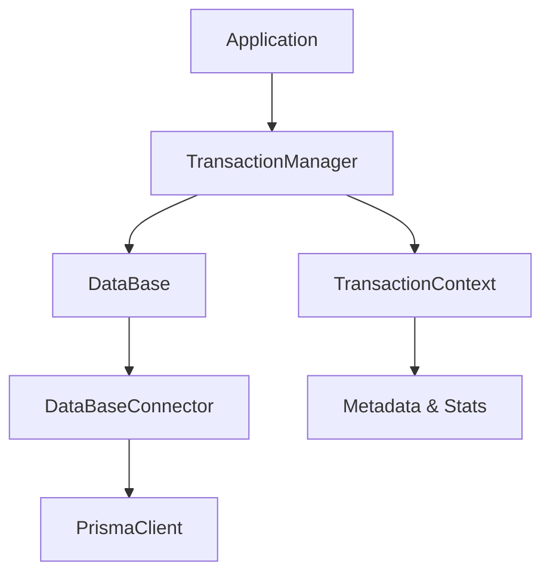

# rdb-command ネストトランザクション機能

このドキュメントでは、rdb-commandパッケージに追加されたネストトランザクション機能について説明します。

## 概要

rdb-commandの`TransactionManager`クラスを使用することで、ネストされた`txn`呼び出しが安全に動作するようになります。Prismaの制限により、実際には単一のデータベーストランザクション内で実行されますが、コードの構造は保たれます。

## 主な機能

- **ネストレベルの追跡**: トランザクションの階層を正確に管理
- **コンテキスト管理**: 各トランザクションの状態と関係性を保持
- **エラーハンドリング**: ネスト内でのエラーを適切に伝播
- **メモリ管理**: WeakMapによる自動ガベージコレクション
- **デバッグ支援**: 詳細なログとメトリクス収集
- **後方互換性**: 既存のAPIを変更せずに拡張

## 使用方法

### 基本的な使用方法

```typescript
import { DataBase, TransactionManager } from '@rym-lib/rdb-command'
import { PrismaConnector } from '@rym-lib/rdb-command/connectors/prisma'

// TransactionManagerを作成
const transactionManager = new TransactionManager()

// DataBaseインスタンスにTransactionManagerを設定
const db = new DataBase(connector, logger, {}, transactionManager)

// または
const db = new DataBase(connector, logger, {}).withTransactionManager(transactionManager)
```

### ネストトランザクションの実行

```typescript
await db.txn(async (outerDb) => {
  console.log('外側のトランザクション')
  
  await outerDb.create('users', { name: 'John', email: 'john@example.com' })

  // ネストされたトランザクション
  await outerDb.txn(async (innerDb) => {
    console.log('内側のトランザクション')
    
    await innerDb.create('profiles', { userId: '1', bio: 'Software Developer' })
    
    // さらなるネスト
    await innerDb.txn(async (deepDb) => {
      await deepDb.create('settings', { userId: '1', theme: 'dark' })
    })
  })
})
```

### エラーハンドリング

```typescript
try {
  await db.txn(async (outerDb) => {
    await outerDb.create('users', { name: 'John' })
    
    await outerDb.txn(async (innerDb) => {
      await innerDb.create('profiles', { userId: '1' })
      
      // エラーが発生すると全体がロールバック
      throw new Error('Something went wrong')
    })
  })
} catch (error) {
  console.log('全体がロールバックされました')
}
```

### トランザクション情報の取得

```typescript
await db.txn(async (txDb) => {
  const info = (txDb as DataBase).getCurrentTransactionInfo()
  console.log('Transaction Info:', {
    isInTransaction: info.isInTransaction,
    contextId: info.contextId,
    level: info.level
  })
})
```

### 統計情報の取得

```typescript
const stats = transactionManager.getStats()
console.log('Active Transactions:', stats.activeTransactions)
console.log('Context Details:', stats.contexts)
```

## 制限事項

1. **Prismaの制限**: Prismaは真のネストトランザクションをサポートしていないため、実際には単一のトランザクション内で実行されます。

2. **部分ロールバック不可**: 内側のトランザクションでエラーが発生した場合、全体がロールバックされます。

3. **セーブポイント未対応**: データベースレベルのセーブポイント機能は使用していません。

## パフォーマンス考慮事項

- TransactionManagerは軽量で、オーバーヘッドは最小限です
- WeakMapを使用してメモリリークを防止
- 長時間実行トランザクションの警告

## 従来のAPIとの互換性

TransactionManager無しのDataBaseインスタンスは、従来通りに動作します：

```typescript
// 従来の方法（そのまま動作）
const db = new DataBase(connector, logger)
await db.txn(async (txDb) => {
  // 従来通りの動作
})
```

## デバッグとトラブルシューティング

### ログの有効化

```typescript
// コンソールにデバッグ情報を出力
console.debug('[TransactionManager] Root transaction started: uuid')
console.debug('[TransactionManager] Nested transaction started: uuid (level: 2)')
```

### 統計情報の監視

```typescript
setInterval(() => {
  const stats = transactionManager.getStats()
  if (stats.activeTransactions > 10) {
    console.warn('多数のアクティブトランザクション:', stats.activeTransactions)
  }
}, 5000)
```

### リソースのクリーンアップ

```typescript
// アプリケーション終了時
transactionManager.destroy()
```

## テスト

実装には包括的なテストスイートが含まれています：

```bash
npm test
```

主なテストカテゴリ：
- 基本的なトランザクション機能
- ネストされたトランザクション
- エラーハンドリング
- メモリ管理
- パフォーマンス
- 並行性

## 実装の詳細

### アーキテクチャ



### コンテキスト管理

- 各トランザクションに一意のIDを割り当て
- 親子関係を追跡
- ネストレベルを管理
- メタデータとタイミング情報を記録

### エラー伝播

- ネスト内のエラーを適切に上位に伝播
- 詳細なエラー情報をログ出力
- クリーンアップ処理を保証

## まとめ

この実装により、rdb-commandでネストトランザクションが安全に使用できるようになりました。Prismaの制限内で最大限の機能を提供し、開発者体験を向上させています。