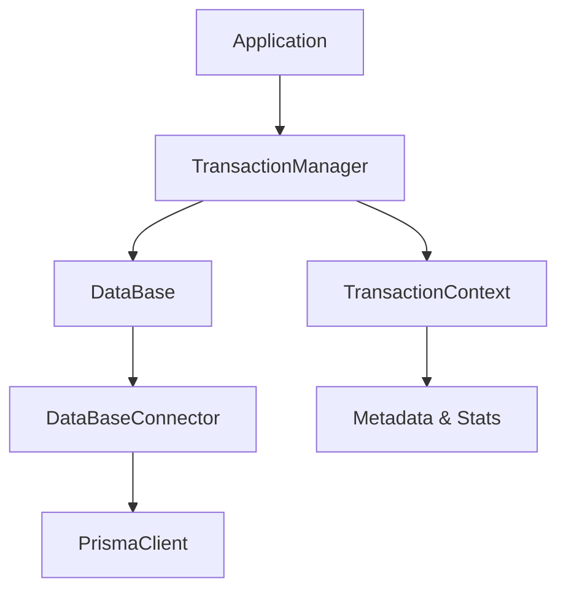

# rdb-command Nested Transaction Feature

This document describes the nested transaction functionality added to the rdb-command package.

## Overview

By using the `TransactionManager` class in rdb-command, nested `txn` calls can now operate safely. Due to Prisma's limitations, operations are actually executed within a single database transaction, but the code structure is preserved.

## Key Features

- **Nest Level Tracking**: Accurately manages transaction hierarchy
- **Context Management**: Maintains state and relationships of each transaction
- **Error Handling**: Properly propagates errors from nested contexts
- **Memory Management**: Automatic cleanup to prevent resource leaks
- **Debug Support**: Detailed logging and metrics collection
- **Backward Compatibility**: Extends existing APIs without breaking changes

## Usage

### Basic Usage

```typescript
import { DataBase, TransactionManager } from '@rym-lib/rdb-command'
import { PrismaConnector } from '@rym-lib/rdb-command/connectors/prisma'

// Create TransactionManager
const transactionManager = new TransactionManager()

// Set TransactionManager to DataBase instance
const db = new DataBase(connector, logger, {}, transactionManager)

// Or
const db = new DataBase(connector, logger, {}).withTransactionManager(transactionManager)
```

### Executing Nested Transactions

```typescript
await db.txn(async (outerDb) => {
  console.log('Outer transaction')
  
  await outerDb.create('users', { name: 'John', email: 'john@example.com' })

  // Nested transaction
  await outerDb.txn(async (innerDb) => {
    console.log('Inner transaction')
    
    await innerDb.create('profiles', { userId: '1', bio: 'Software Developer' })
    
    // Further nesting
    await innerDb.txn(async (deepDb) => {
      await deepDb.create('settings', { userId: '1', theme: 'dark' })
    })
  })
})
```

### Error Handling

```typescript
try {
  await db.txn(async (outerDb) => {
    await outerDb.create('users', { name: 'John' })
    
    await outerDb.txn(async (innerDb) => {
      await innerDb.create('profiles', { userId: '1' })
      
      // Error causes entire rollback
      throw new Error('Something went wrong')
    })
  })
} catch (error) {
  console.log('Entire transaction was rolled back')
}
```

### Getting Transaction Information

```typescript
await db.txn(async (txDb) => {
  const info = (txDb as DataBase).getCurrentTransactionInfo()
  console.log('Transaction Info:', {
    isInTransaction: info.isInTransaction,
    contextId: info.contextId,
    level: info.level
  })
})
```

### Getting Statistics

```typescript
const stats = transactionManager.getStats()
console.log('Active Transactions:', stats.activeTransactions)
console.log('Context Details:', stats.contexts)
```

## Limitations

1. **Prisma Limitations**: Since Prisma doesn't support true nested transactions, operations are actually executed within a single transaction.

2. **No Partial Rollback**: If an error occurs in an inner transaction, the entire transaction is rolled back.

3. **No Savepoint Support**: Database-level savepoint functionality is not utilized.

## Performance Considerations

- TransactionManager is lightweight with minimal overhead
- Uses WeakMap to prevent memory leaks
- Periodic cleanup of orphaned contexts
- Warnings for long-running transactions

## Compatibility with Legacy APIs

DataBase instances without TransactionManager continue to work as before:

```typescript
// Legacy approach (continues to work)
const db = new DataBase(connector, logger)
await db.txn(async (txDb) => {
  // Works as before
})
```

## Debugging and Troubleshooting

### Enabling Logs

```typescript
// Output debug information to console
console.debug('[TransactionManager] Root transaction started: uuid')
console.debug('[TransactionManager] Nested transaction started: uuid (level: 2)')
```

### Monitoring Statistics

```typescript
setInterval(() => {
  const stats = transactionManager.getStats()
  if (stats.activeTransactions > 10) {
    console.warn('High number of active transactions:', stats.activeTransactions)
  }
}, 5000)
```

### Resource Cleanup

```typescript
// On application shutdown
transactionManager.destroy()
```

## Testing

The implementation includes a comprehensive test suite:

```bash
npm test
```

Main test categories:
- Basic transaction functionality
- Nested transactions
- Error handling
- Memory management
- Performance
- Concurrency

## Implementation Details

### Architecture



### Context Management

- Assigns unique IDs to each transaction
- Tracks parent-child relationships
- Manages nesting levels
- Records metadata and timing information

### Error Propagation

- Properly propagates errors from nested contexts upward
- Outputs detailed error information to logs
- Ensures cleanup processing

## Summary

This implementation enables safe use of nested transactions in rdb-command. It provides maximum functionality within Prisma's constraints while improving the developer experience.